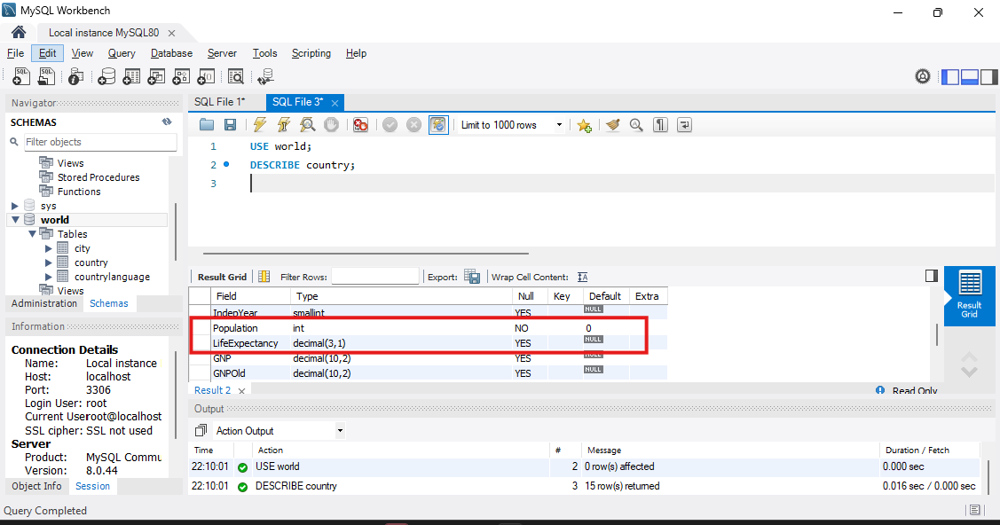
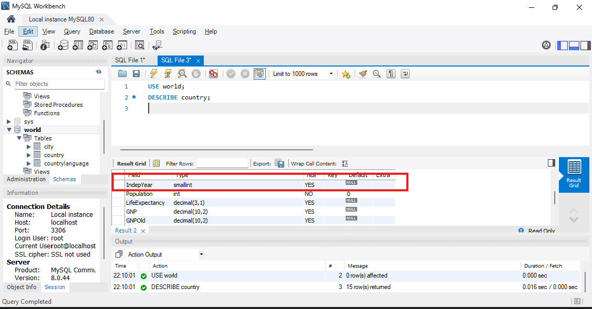
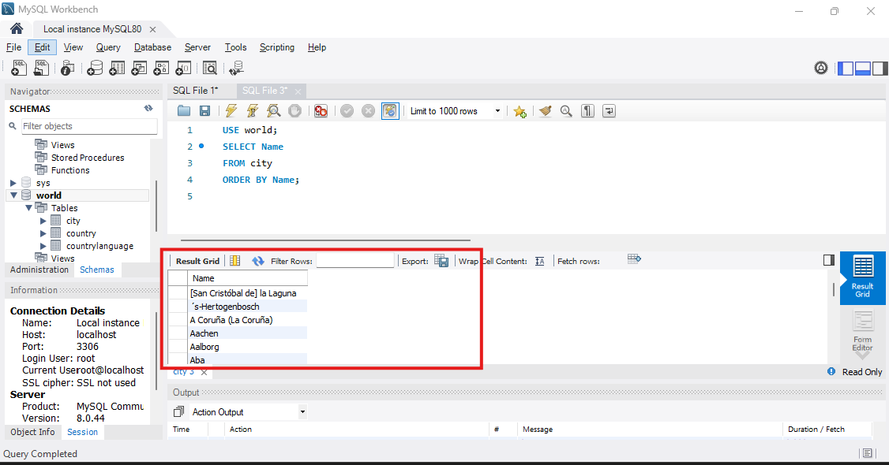
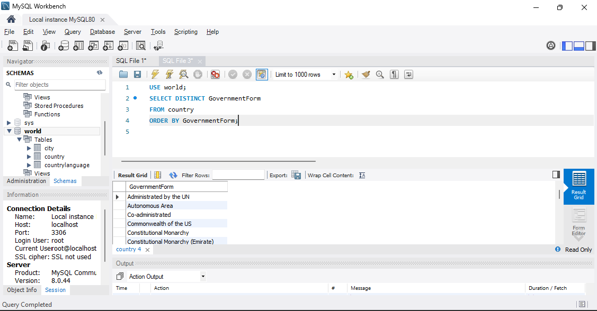
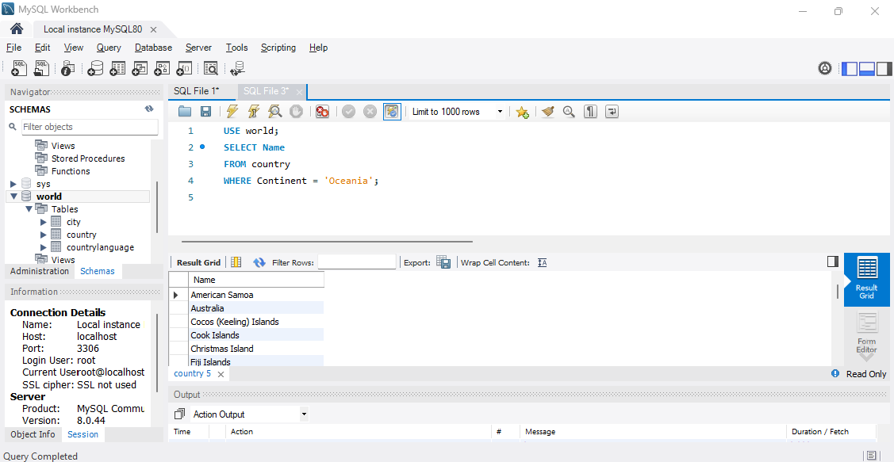
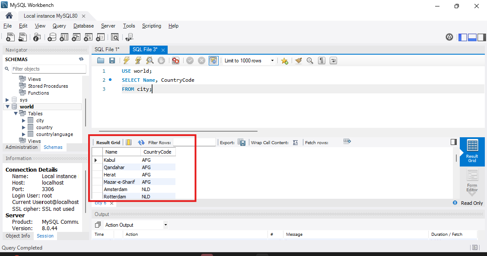
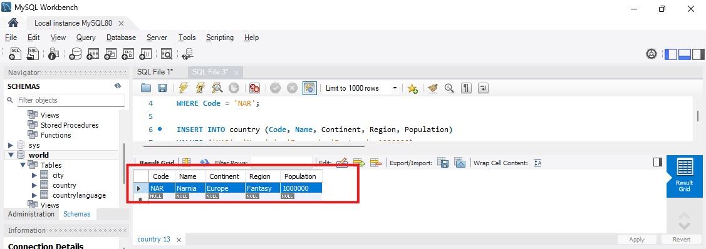
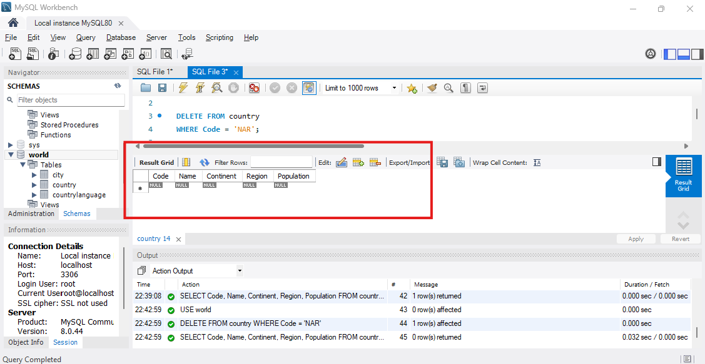

# Exercise 01: World Database SQL Practice

- Name: Kiruthikaa NS
- Course: Database for Analytics
- Module: 1
- Database Used: World Database

---

## Instructions

- Answer each question below.
- All SQL commands **must be executed** against the World database.
- For each SQL command:
  - Include the SQL in a fenced code block
  - Include a **screenshot** showing the command and results
- Store screenshots in the `screenshots/` folder and embed them below each answer.

---

## Question 1

**Compare and contrast the data types used for:**
- `country.Population`
- `country.LifeExpectancy`

Why were these data types selected?

### Answer
`country.Population` uses an integer data type because population is a count of people and must be a whole number. Fractions do not make sense for population, and integer types are efficient for storing large whole numbers.

`country.LifeExpectancy` uses a decimal data type because life expectancy often includes fractional values, such as 72.5 years. A decimal type allows storing both whole and fractional parts accurately.

These data types were selected because they match the real-world nature of the data- population is a whole-number count, while life expectancy is a measured value that can include decimals. 


### Screenshot
_Show the table structure or DESCRIBE output._

```sql
DESCRIBE country;
```



---

## Question 2

**What is the data type of `country.IndepYear`?**
Why do you think this data type was selected?

### Answer
The data type of `country.IndepYear` is `smallint`.

This data type was selected because independence years are small whole numbers, usually between the 1700s and 2000s. A `smallint` uses less storage than a regular integer and is enough to store year values. It also allows NULL values for countries that do not have an independence year.


### Screenshot

```sql
DESCRIBE country;
```



---

## Question 3

**Make a case for a different data type for `country.IndepYear`.**
Explain why your proposed data type might be better in some situations.

### Answer
A possible alternative data type for `country.IndepYear` is the `YEAR` data type.

Using `YEAR` would make the meaning of the column clearer, because it directly represents a year rather than a general number. It also helps with validation, since MySQL can restrict values to valid year formats.

In situations where we want to perform date-related calculations, comparisons by decade, or formatting based on year, using the `YEAR` type can be more expressive and easier to understand than using a generic numeric type like `smallint`.

---

## Question 4

Write a SQL command to **list the names of all cities in alphabetical order**.

### SQL

```sql
SELECT Name
FROM city
ORDER BY Name;
```

### Screenshot



---

## Question 5

Write a SQL command to **list all forms of government from the `country` table**, showing **each only once**, sorted alphabetically.

### SQL

```sql
SELECT DISTINCT GovernmentForm
FROM country
ORDER BY GovernmentForm;
```

### Screenshot



---

## Question 6

Write a SQL command to **list all countries in the `Oceania` continent**.

### SQL

```sql
SELECT Name
FROM country
WHERE Continent = 'Oceania';
```

### Screenshot



---

## Question 7

Write a SQL command to **list the names and country code of all cities**.

### SQL

```sql
SELECT Name, CountryCode
FROM city;
```

### Screenshot



---

## Question 8

Write a SQL command to **update the city named `"Nashville-Davidson"` to `"Nashville"`**.

### SQL

```sql
UPDATE city
SET Name = 'Nashville'
WHERE Name = 'Nashville-Davidson';
```

### Screenshot


---

## Question 9

Write a SQL command to **insert a new country named `"Narnia"`** with a country code of `"NAR"`.
Use reasonable values for the remaining columns.

### SQL

```sql
INSERT INTO country (Code, Name, Continent, Region, Population)
VALUES ('NAR', 'Narnia', 'Europe', 'Fantasy', 1000000);
```

### Screenshot



---

## Question 10

Write a SQL command to **delete the country with the country code `"NAR"`**.

### SQL

```sql
DELETE FROM country
WHERE Code = 'NAR';
```

### Screenshot


